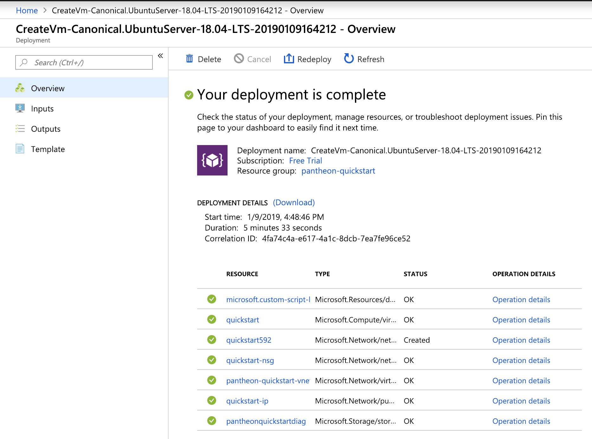
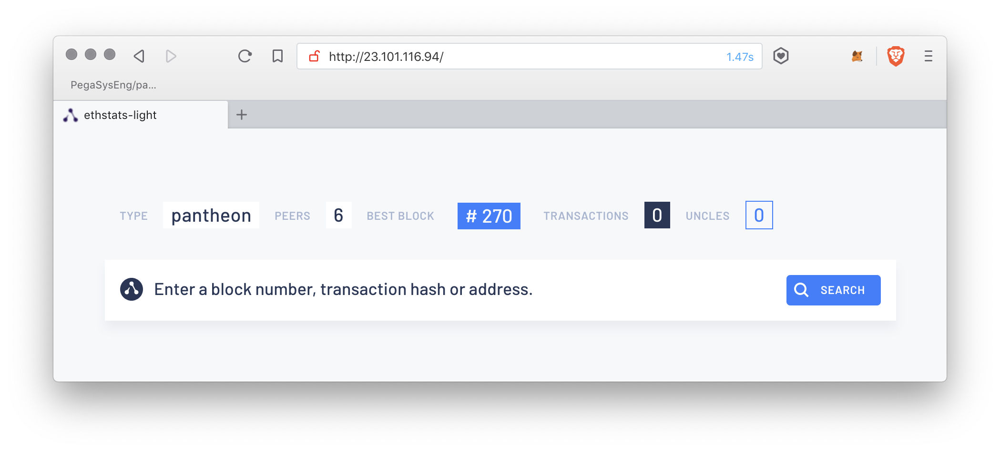

description: Pantheon private network quickstart on Azure tutorial
<!--- END of page meta data -->

# Azure Private Network Quickstart tutorial

This tutorial describes how to use the [Pantheon quickstart](https://github.com/PegaSysEng/pantheon-quickstart) 
to run a private network of Pantheon nodes in a Docker container in a Linux Virtual 
machine hosted on Microsoft Azure.

## Requirements

* An azure account. A [free trial account](https://azure.microsoft.com/en-us/free/) will work for this tutorial.
* Be able to conne t to a remote console using SSH. If you use Linux or macOS, you already have one 
integrated, otherwise you can try tools like [Putty](https://www.putty.org/) (free; open-source), 
[mRemoteNG](https://mremoteng.org/) (free; open-source), 
[Terminals](https://github.com/terminals-Origin/Terminals) (free; open-source)
or [MobaXterm](https://mobaxterm.mobatek.net/) (free; paid Pro version available).

## Connect to Azure Portal
Log in to [Azure portal](https://portal.azure.com/) using your account credentials.

## Creating resources
On the home page, click on 
at the top left hand corner.

Search the Marketplace for **Ubuntu Server 18.04 LTS** by Canonical and click on it. 
An information page is displayed. Accept the default deployment model of Resource Manager and click **Create**.

In **Create a virtual machine**, set the following values for each tab as follows::

### Basics step
  * Subscription --> free trial
  * Resource group --> create a new one and call it as you like, "pantheon-quickstart" may be a good name.
  * Virtual machine name --> quickstart
  * Region --> **Central US** will probably selected by default, don't bother changing it.
  * Availability options --> No infrastructure redundancy required
  * Image --> Ubuntu Server 18.04 LTS
  * Size --> You can keep the proposed hosting plan size as this quickstart won't require a lot 
  of power and disk space. A **Standard D2s v3 (2 vcpus, 8 GB memory)** will do the job and will be 
  less expensive.
  * Authentication type --> choose the one you prefer, as this is not a critical machine, you can just
  use a password, but a SSH public key is nice too and simpler if you have one.
  * Username --> provide a user name, here we propose **azure** as a user name and we'll use it all 
  along this tutorial.
  * Depending on the authentication method you chose, either fill the password or the public key.
  * Login with Azure Acrive Directory --> keep it **off**
  * Public inbound ports --> Allow selected ports
  * Select inbound ports --> select **HTTP** and **SSH**
  
Then go up on the top of the page and switch to the **Guest config** step tab.

### Guest config
This step aims at installing required software (Docker and Docker-compose) on your virtual machine 
and retrieve and run the quickstart private network.

To do so, click on the link named **Select an extension to install** and a new resource pane will
appear on the right.

In the list click on **Custom Script For Linux**, another pane opens with a blue **Create** button at
its bottom, click on it.

A form with only two fields appear:

First open another browser tab or window with [https://raw.githubusercontent.com/PegaSysEng/pantheon-quickstart/master/azure/install_and_run.sh](https://raw.githubusercontent.com/PegaSysEng/pantheon-quickstart/master/azure/install_and_run.sh)

Save (++ctrl+s++) this script to your computer, anywhere you like, as install_and_run.sh. 

Then click on the **Script files** field, and once the file browsing dialog appear, select the `install_and_run.sh` 
you just saved.

Fill the second field named **Command** with the following informations (replacing the pre filled `sh script.sh`):

```bash
sh install_and_run.sh azure
```

!!!important
    The username is included at the end of this command, **azure** in our case, but change
    to whatever you defined on the Basics step if you did not use the same as us.
    
Then click **Ok** and then on the **Review + create** blue button at the bottom.

Then once everything is ok (a green **Validation passed** message should show on the top of the screen), 
press the blue **Create** button.

You should see a **Your deployment is underway** screen with all the resources creating. It takes
some time, around 5mn, so be patient and have a nice :tea: or :coffee:.

Once the deployment is done, you should see **Your deployment is complete** and a list of all the
deployed resources with green check-marks.



CLick on the resource named **quickstart** in this list and you'll land on the virtual
machine overview page.

## Accessing the Alethio EthStat-light explorer

On the right part of the virtual machine page you can read the **Public IP address** of this machine. 
Copy it then open a new browser tab or window and past it in the navigation bar.

You now should see the the EthStat-light explorer.
Wait a few seconds and you should see 6 multicaster indicated and a few blocks mined.



## Rpc enpoints

For the following tutorial steps, you will have to know that your RPC endpoints are the
following :

* for the HTTP RPC endpoint: **http://&lt;your VM public IP>/jsonrpc**
* for the Web Socket RPC endpoint: **ws://&lt;your VM public IP>/jsonws**

You can now follow the quickstart tutorial starting from 
[the part where we show how to create RPC requests](../Private-Network-Quickstart.md#run-json-rpc-requests).

## Shutting down the quickstart

!!!attention
    Don't forget to shutdown the quickstart it you don't need it as it will consume your Azure resources
    and that can be expensive of at least drain your free credits from your free trial account.

You have multiple ways to shutdown the quickstart depending on if you want to restart it
from scratch after that or continue using the same installation. Here are the options:

### I want to remove everything from my Azure account.

This is the only way to be sure your Azure resources won't consume any credits.

To do so, simply navigate in the Azure portal to your resource group, the one we named **pantheon-quickstart**
then click on the **Delete resource group** button.

### I want to remove the virtual machine only.
Then simply navigate in the Azure portal to your resource group, the one we named **pantheon-quickstart**
then click on the virtual machine resource and click the **Delete** button.

### I want to keep the VM but remove the nodes network.
Navigate to the VM in your Azure portal (click on **All services** in the left pane, then on 
**Virtual machines** and click on the one you named **quickstart**) and click the **connect** 
button that will give you the information to connect with SSH (see [Requirements](#requirements)).

Once connected to the machine, navigate to the pantheon-quickstart directory:
```bash
cd pantheon-quickstart
``` 
then run the remove script
```bash
./remove.sh
```

If you want to run the network again, then you can use the following script:
```bash
./run.sh -p 80
```

Where 80 is the port number to use for Block Explorer and RPC connections.
 
### I just want to stop the nodes network and be able to resume it.
Connect to the VM using SSH like for "[I want to keep the VM but remove the nodes network.](#i-want-to-keep-the-vm-but-remove-the-nodes-network)"
but instead of running the remove script, run the stop script.
```bash
./stop.sh
```
you will be then able to resume the network with
```bash
./resume.sh
```